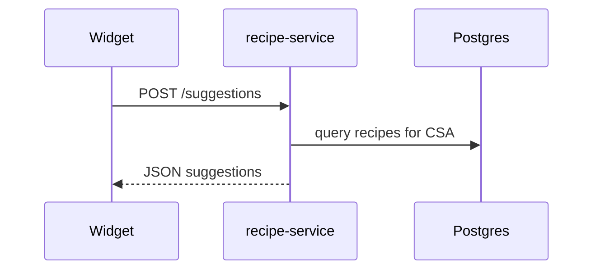

# Architecture

The stack consists of a single `recipe-service` backed by a Postgres database and an embeddable web widget.
Requests flow from the widget -> recipe-service -> database.

Run everything locally with `docker compose up` then include `dist/recipe-widget.umd.cjs` on any page.
